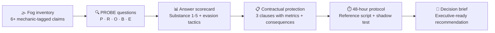

# PROBE Dossier: vendor intelligence you can actually act on

  

## Build this yourself — paste and go

Everything below is re-parameterized for your own vendor. Replace the bracketed tokens, paste the block into your workspace, and you have a live evaluation scaffold.

```text
# PROBE Dossier — your vendor

Vendor: [YOUR VENDOR NAME]
Evaluator: [YOUR NAME] — [YOUR ROLE]

## Fog inventory (minimum 6 elements)
1. Claim: [PASTE VENDOR CLAIM] | Mechanic: [e.g. Denominator Problem] | Missing variable: [e.g. baseline conversion rate]
2. Claim: [PASTE VENDOR CLAIM] | Mechanic: [e.g. Name-Drop Halo] | Missing variable: [e.g. contract scope at named logo]
3–6. [continue for each fog element]

Suspicion statement: [ONE SENTENCE — what you cannot currently verify and why it matters]

## PROBE questions (one per dimension, each quoting a fog element)
P — Problem Fit: [YOUR QUESTION referencing fog element 1]
R — Results Evidence: [YOUR QUESTION referencing fog element 2]
O — Ownership: [YOUR QUESTION referencing fog element 3]
B — Benchmarks: [YOUR QUESTION referencing fog element 4]
E — Exit Terms: [YOUR QUESTION referencing fog element 5]

## Confidence rating after scoring
[ ] Proceed   [ ] Proceed with Conditions   [ ] Do Not Proceed

## Top contract condition
[YOUR METRIC] measured by [YOUR METHOD] within [YOUR TIMELINE]; consequence: [YOUR CONSEQUENCE]
```

> **Example values from this build:** Vendor = an AI-assisted enterprise search tool; fog element 1 = "reduces search time by 40%" (Denominator Problem — 40% of what baseline, for which query types?); top contract condition = average query resolution time under 45 seconds on a 500-query shadow test within 90 days, with a no-penalty exit if missed.

---

## How this dossier was built

Marques ran the full PROBE Protocol against **ABC**, moving from raw fog inventory through sharpened questions, scored answers, contractual protection clauses, and a 48-hour follow-up protocol — then distilled everything into a one-page brief a procurement committee could act on without reading the underlying dossier.



---

## Proof artifacts

| File | Contents |
|------|----------|
| [dossier.md](./dossier.md) | Full five-part PROBE Dossier |
| [decision-brief.md](./decision-brief.md) | One-page executive recommendation |
| [blueprints/dossier-blank.md](./blueprints/dossier-blank.md) | Blank dossier template for reuse |
| [blueprints/chat.md](./blueprints/chat.md) | Chat prompt for continued PROBE analysis |
| [blueprints/worksheet.md](./blueprints/worksheet.md) | Blank worksheet for next evaluation |

---

## my-build/

Put screenshots, session notes, and vendor response artifacts here.

---

Model-assisted draft — review before sharing.
